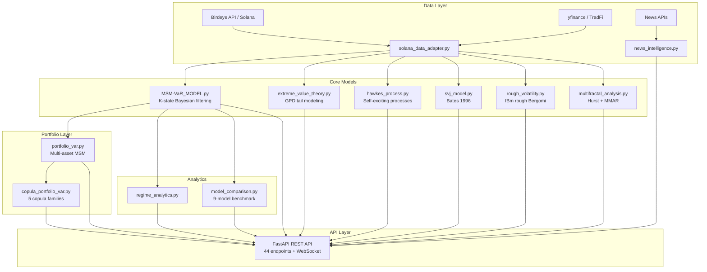

# CortexAgent Risk Engine

> **Multi-model volatility and risk management framework for autonomous DeFi trading agents on Solana.**
>
> Built by [Cortex AI](https://www.cortex-agent.xyz) — combining MSM regime detection, Extreme Value Theory, Hawkes processes, SVJ, copula dependence, rough volatility, multifractal analysis, and a unified Guardian risk veto layer. Exposed via a 45-endpoint REST API and a published [TypeScript SDK (`cortex-risk-sdk`)](https://www.npmjs.com/package/cortex-risk-sdk).

[](https://www.npmjs.com/package/cortex-risk-sdk)
[]()
[](LICENSE)

---

## Abstract

Financial markets exhibit non-stationary dynamics characterized by abrupt regime transitions, heavy-tailed return distributions, volatility clustering, and contagion-driven crash cascades. Traditional single-model risk frameworks — such as standalone GARCH or constant-volatility VaR — fail to capture these phenomena simultaneously, leading to systematic underestimation of tail risk during crisis periods. This paper presents the **CortexAgent Risk Engine**, a modular quantitative framework that integrates seven complementary stochastic models into a unified risk assessment pipeline. The core Markov-Switching Multifractal (MSM) model provides real-time regime detection via Bayesian filtering across K volatility states. This is augmented by Generalized Pareto Distribution (GPD) tail modeling, Hawkes self-exciting point processes for crash contagion, the Bates (1996) Stochastic Volatility with Jumps (SVJ) model, five-family copula dependence structures with regime-conditional selection, rough Bergomi volatility (H ≈ 0.1), and multifractal spectrum analysis. A Guardian integration layer consolidates all model outputs into a single composite risk score with circuit-breaker logic for autonomous trade veto. The system is validated through Kupiec and Christoffersen backtests and exposed via a 45-endpoint REST API with a published TypeScript SDK designed for integration with autonomous trading agents on Solana.

---

## Table of Contents

1. [Introduction](#1-introduction)
2. [Mathematical Foundation](#2-mathematical-foundation)
3. [Methodology](#3-methodology)
4. [Implementation Architecture](#4-implementation-architecture)
5. [API Reference](#5-api-reference)
6. [TypeScript SDK](#6-typescript-sdk)
7. [Results and Validation](#7-results-and-validation)
8. [Reproducibility](#8-reproducibility)
9. [Docker](#9-docker)
10. [Limitations](#10-limitations)
11. [References](#11-references)
12. [License and Authors](#12-license-and-authors)

---

## 1. Introduction

### 1.1 Problem Statement

Quantitative risk management in decentralized finance (DeFi) faces a compounding set of challenges absent from traditional markets:

- **Non-stationarity**: Solana DeFi token volatility can shift from 0.3% to 5%+ daily within hours during liquidity crises, rendering stationary models obsolete.
- **Heavy tails**: Empirical return distributions exhibit excess kurtosis of 5–20×, meaning Gaussian VaR systematically underestimates the probability of extreme losses.
- **Contagion dynamics**: Liquidation cascades propagate across correlated protocols, creating self-exciting crash clusters that violate the independence assumption of classical risk models.
- **Jump discontinuities**: Token prices exhibit discrete jumps from oracle manipulation, exploit events, and sudden liquidity withdrawal — phenomena not captured by continuous diffusion models.

No single volatility model addresses all four phenomena. GARCH captures clustering but assumes a fixed regime. EVT models tails but ignores temporal dynamics. Hawkes processes model contagion but not the underlying volatility surface.

### 1.2 Motivation and Approach

The Cortex Risk Engine resolves this through **model composition**: each module targets a specific statistical phenomenon, and their outputs are combined through a weighted risk aggregation layer. The design philosophy follows three principles:

1. **Regime-conditional everything** — All risk measures are conditioned on the current MSM regime state, ensuring that VaR, copula parameters, and position limits adapt in real-time to market conditions.
2. **Tail-aware by construction** — EVT and SVJ models explicitly capture the behavior of returns beyond the 99th percentile, where Gaussian approximations fail catastrophically.
3. **Contagion-sensitive** — Hawkes process intensity monitoring provides early warning of crash clustering, enabling preemptive position reduction before cascading liquidations.

### 1.3 Contributions

This framework makes the following contributions:

- A production-ready implementation of the Calvet & Fisher (2004) MSM model with K-state Bayesian filtering, asymmetric transition matrices, and Student-t VaR extensions.
- Integration of seven complementary risk models into a single coherent pipeline with 347 passing unit tests.
- A Guardian risk veto layer that consolidates EVT (25%), SVJ (20%), Hawkes (20%), Regime (20%), and News (15%) scores into a single composite risk assessment with circuit-breaker logic.
- A 45-endpoint REST API with WebSocket regime streaming, designed for sub-10ms query latency.
- A published TypeScript SDK ([`cortex-risk-sdk`](https://www.npmjs.com/package/cortex-risk-sdk)) with cockatiel resilience (retry, circuit breaker, timeout) and zod runtime validation.
- Regime-dependent copula selection that dynamically switches between Gaussian (calm) and Student-t (crisis) dependence structures based on filtered regime probabilities.

---

## 2. Mathematical Foundation

### 2.1 Markov-Switching Multifractal (MSM) Model

The MSM model (Calvet & Fisher, 2004) assumes log-returns follow a mixture of K Gaussian distributions, where the active component is governed by a latent Markov chain.

**Return dynamics:**

```
r_t = μ + σ_{S_t} · ε_t,    ε_t ~ N(0,1)
```

where S_t ∈ {1, ..., K} is the latent regime state with volatility levels σ_1 < σ_2 < ... < σ_K arranged in geometric progression:

```
σ_k = σ_low · (σ_high / σ_low)^((k-1)/(K-1)),    k = 1, ..., K
```

**Transition matrix:** The regime evolves according to a K×K transition matrix P where P_{ij} = Pr(S_{t+1} = j | S_t = i). The asymmetric variant allows state-dependent persistence:

```
P_{ii} = p_stay^(i),    P_{ij} = (1 - p_stay^(i)) / (K - 1)    for i ≠ j
```

**Bayesian filtering:** Given observed returns r_1, ..., r_t, the filtered regime probabilities are updated recursively:

```
π_{k,t|t} = Pr(S_t = k | r_1, ..., r_t) ∝ f(r_t | S_t = k) · Σ_j P_{jk} · π_{j,t-1|t-1}
```

where f(r_t | S_t = k) = φ(r_t; μ, σ_k²) is the Gaussian likelihood under state k.

**Volatility forecast:**

```
σ_{t+1|t} = Σ_k π_{k,t+1|t} · σ_k,    where π_{t+1|t} = P' · π_{t|t}
```

**VaR computation:**

```
VaR_α = z_α · σ_{t+1|t}
```

For Student-t extensions with ν degrees of freedom, z_α is replaced by t_α^{-1}(ν) · √((ν-2)/ν).

**Calibration:** Four methods are implemented — Maximum Likelihood Estimation (MLE) via L-BFGS-B optimization, exhaustive grid search, empirical quantile matching, and a hybrid approach combining MLE with iterative breach-rate adjustment. Complexity: O(T·K²) per filtering pass, O(T·K²·I) for MLE with I optimizer iterations.

### 2.2 Extreme Value Theory (EVT) — Generalized Pareto Distribution

For modeling the tail beyond a high threshold u, the excess distribution converges to the Generalized Pareto Distribution (GPD) by the Pickands–Balkema–de Haan theorem (McNeil & Frey, 2000):

```
Pr(X - u ≤ y | X > u) → G_{ξ,β}(y) = 1 - (1 + ξy/β)^(-1/ξ)
```

where ξ is the shape parameter (ξ > 0 implies heavy tails, ξ < 0 implies bounded tails) and β > 0 is the scale parameter.

**EVT-VaR at confidence level α:**

```
VaR_α = u + (β/ξ) · [(n/N_u · (1-α))^(-ξ) - 1]
```

**Expected Shortfall (CVaR):**

```
ES_α = VaR_α / (1 - ξ) + (β - ξ·u) / (1 - ξ)
```

The threshold u is set at the 90th percentile of losses by default. Parameters are estimated via MLE on the exceedances. Complexity: O(N_u · I) where N_u is the number of exceedances.

### 2.3 Hawkes Self-Exciting Point Process

The Hawkes process (Hawkes, 1971) models event clustering where each event increases the probability of subsequent events — capturing liquidation cascades and panic selling:

```
λ(t) = μ + Σ_{t_i < t} α · exp(-β · (t - t_i))
```

where μ is the baseline intensity, α is the excitation magnitude, and β is the exponential decay rate.

**Branching ratio:** η = α/β. The process is stationary iff η < 1. When η → 1, the system approaches criticality (self-sustaining cascades).

**Flash crash risk score:** Derived from the ratio of current intensity to baseline: risk = min(1, (λ(t) - μ) / (3μ)).

**VaR adjustment:** The Hawkes intensity multiplier scales the base VaR: VaR_adjusted = VaR_base · (1 + γ · (λ(t)/μ - 1)) where γ is a sensitivity parameter.

Calibration uses MLE on inter-arrival times. Complexity: O(N²) for exact likelihood, O(N) with recursive computation.

### 2.4 Stochastic Volatility with Jumps (SVJ) — Bates (1996)

The Bates model extends Heston stochastic volatility with compound Poisson jumps:

```
dS/S = (r - λ·μ_J)dt + √V_t · dW_1 + J · dN_t
dV_t = κ(θ - V_t)dt + σ_v · √V_t · dW_2
```

where corr(dW_1, dW_2) = ρ (leverage effect), N_t is a Poisson process with intensity λ, and J ~ N(μ_J, σ_J²).

**Feller condition:** 2κθ ≥ σ_v² ensures V_t > 0 almost surely.

**Jump detection:** The Barndorff-Nielsen & Shephard (2006) bipower variation test statistic identifies days with statistically significant jumps.

**Risk decomposition:**

```
Total variance = Diffusion variance + Jump variance
               = θ + λ · (μ_J² + σ_J²)
```

SVJ VaR is computed via Monte Carlo simulation (default: 50,000 paths) of the discretized SDE system. Complexity: O(N_sim · T) per VaR estimate.

### 2.5 Copula Dependence Modeling

For portfolio risk, marginal distributions are separated from the dependence structure via Sklar's theorem. Five copula families are implemented:

| Family | Tail Dependence | Use Case |
|--------|----------------|----------|
| Gaussian | None (λ_L = λ_U = 0) | Calm regimes, diversified portfolios |
| Student-t | Symmetric (λ_L = λ_U > 0) | Crisis regimes, tail co-movement |
| Clayton | Lower tail (λ_L > 0, λ_U = 0) | Crash co-dependence |
| Gumbel | Upper tail (λ_L = 0, λ_U > 0) | Bubble co-movement |
| Frank | None | Moderate symmetric dependence |

**Regime-dependent selection:** The copula family is chosen based on the MSM regime state. States in the top 40% of the volatility spectrum (crisis) use Student-t copulas; the remainder use Gaussian. VaR is computed as a probability-weighted mixture across all regime-copula pairs.

### 2.6 Rough Volatility — Rough Bergomi Model

Empirical evidence (Gatheral et al., 2018) shows that log-volatility behaves as a fractional Brownian motion (fBm) with Hurst exponent H ≈ 0.1, far below the H = 0.5 of standard Brownian motion:

```
log V_t = log V_0 + ν · √(2H) · ∫_0^t (t-s)^(H-0.5) dW_s
```

The roughness parameter H is estimated via the variogram method on realized volatility increments. Forecasts use the conditional expectation of the rough Bergomi model.

### 2.7 Multifractal Spectrum Analysis

The multifractal spectrum f(α) characterizes the distribution of local Hölder exponents across time scales. The spectrum width Δα = α_max - α_min quantifies the degree of multifractality:

- **Δα ≈ 0**: Monofractal (single scaling law)
- **Δα > 0.5**: Significant multifractality (multiple scaling regimes)

The Hurst exponent is estimated via both R/S analysis (Hurst, 1951) and Detrended Fluctuation Analysis (DFA). Long-range dependence is tested by comparing H against the null hypothesis H = 0.5.

---

## 3. Methodology

### 3.1 Model Selection Rationale

Each model was selected to address a specific gap in the risk measurement pipeline:

| Model | Phenomenon Addressed | Alternative Considered | Reason for Selection |
|-------|---------------------|----------------------|---------------------|
| MSM | Regime switching | HMM-GARCH | MSM's multifractal structure captures long-memory volatility clustering that single-regime GARCH misses |
| EVT/GPD | Tail risk | Historical simulation | GPD provides parametric extrapolation beyond observed data, critical for rare-event quantification |
| Hawkes | Crash contagion | ETAS, ACD | Hawkes offers closed-form intensity with interpretable branching ratio; simpler than ETAS for financial applications |
| SVJ (Bates) | Jump risk | Merton jump-diffusion | Bates adds stochastic volatility to Merton, capturing the leverage effect (ρ < 0) observed in crypto markets |
| Copulas | Dependence | DCC-GARCH | Copulas separate marginals from dependence, enabling regime-conditional family switching |
| Rough Bergomi | Volatility microstructure | RFSV | Rough Bergomi is the canonical rough volatility model with tractable simulation |
| Multifractal | Scaling properties | Wavelet MF-DFA | R/S + DFA provide complementary Hurst estimates with well-understood statistical properties |

### 3.2 Backtesting Framework

VaR model validation follows the regulatory standard (Basel III) using three complementary tests:

1. **Kupiec (1995) Unconditional Coverage:** Tests whether the empirical breach rate matches the theoretical level α. Test statistic: LR_UC ~ χ²(1).
2. **Christoffersen (1998) Independence:** Tests whether VaR breaches are serially independent (no clustering). Test statistic: LR_IND ~ χ²(1).
3. **Conditional Coverage:** Joint test combining both: LR_CC = LR_UC + LR_IND ~ χ²(2).

A model passes validation when all three p-values exceed 0.05.

### 3.3 Model Comparison

Nine volatility models are benchmarked on identical return series:

MSM, GARCH(1,1), EGARCH(1,1), GJR-GARCH(1,1,1), Rolling-20d, Rolling-60d, EWMA(λ=0.94), Rough Bergomi, and SVJ-Bates.

Comparison metrics: Mean Absolute Error (MAE) of volatility estimates, Akaike Information Criterion (AIC), VaR breach rate, and Kupiec/Christoffersen test pass/fail.

---

## 4. Implementation Architecture

### 4.1 System Overview



### 4.2 Module Inventory

| Module | File | Lines | Functions | Description |
|--------|------|-------|-----------|-------------|
| MSM Core | `MSM-VaR_MODEL.py` | 995 | 12 | Regime detection, Bayesian filtering, VaR |
| EVT | `extreme_value_theory.py` | 419 | 6 | GPD fitting, tail VaR, Expected Shortfall |
| Hawkes | `hawkes_process.py` | 489 | 7 | Event clustering, flash crash detection |
| SVJ | `svj_model.py` | 670 | 6 | Jump detection, Bates calibration, MC VaR |
| Copula | `copula_portfolio_var.py` | 660 | 8 | 5 families, regime-dependent selection |
| Rough Vol | `rough_volatility.py` | 594 | 5 | fBm estimation, rough Bergomi forecasts |
| Multifractal | `multifractal_analysis.py` | 475 | 4 | Hurst (R/S + DFA), spectrum, LRD test |
| Portfolio | `portfolio_var.py` | 279 | 3 | Multi-asset MSM, marginal/stress VaR |
| Regime Analytics | `regime_analytics.py` | ~200 | 4 | Duration, statistics, history, transitions |
| Model Comparison | `model_comparison.py` | 346 | 2 | 9-model benchmark framework |
| News Intelligence | `news_intelligence.py` | ~300 | 3 | Sentiment scoring, market signals |
| Guardian | `guardian.py` | 241 | 5 | Unified risk veto, composite scoring |
| Solana Adapter | `solana_data_adapter.py` | ~250 | 3 | Birdeye, Drift, Raydium data fetching |

### 4.3 Project Structure

```
cortexagent/
├── MSM-VaR_MODEL.py              # Core MSM model
├── extreme_value_theory.py       # EVT / GPD
├── hawkes_process.py             # Hawkes self-exciting process
├── svj_model.py                  # Bates SVJ model
├── copula_portfolio_var.py       # Copula dependence + regime-dependent
├── rough_volatility.py           # Rough Bergomi
├── multifractal_analysis.py      # Hurst exponent + MMAR
├── portfolio_var.py              # Multi-asset portfolio VaR
├── regime_analytics.py           # Regime temporal analysis
├── model_comparison.py           # 9-model benchmark
├── news_intelligence.py          # News sentiment engine
├── guardian.py                   # Unified risk veto layer
├── solana_data_adapter.py        # Solana DeFi data adapter
├── demo_run.py                   # End-to-end demonstration script
├── api/
│   ├── main.py                   # FastAPI application entry point
│   ├── models.py                 # Pydantic request/response schemas
│   └── routes.py                 # 45 API endpoint handlers
├── sdk/                          # TypeScript SDK (cortex-risk-sdk on npm)
│   ├── src/
│   │   ├── client.ts             # RiskEngineClient — 45 typed methods
│   │   ├── types.ts              # Interfaces + zod schemas
│   │   ├── errors.ts             # Error hierarchy
│   │   ├── utils.ts              # Cockatiel resilience policies
│   │   ├── websocket.ts          # RegimeStreamClient
│   │   └── index.ts              # Public exports
│   ├── tests/
│   │   └── client.test.ts        # 12 SDK tests
│   ├── examples/
│   │   └── cortex-agent.ts       # Example trading agent
│   ├── package.json
│   └── tsconfig.json
├── tests/
│   ├── conftest.py               # Shared fixtures (returns, filter_probs)
│   ├── test_msm_core.py          # 17 tests
│   ├── test_extreme_value_theory.py  # 19 tests
│   ├── test_copula_portfolio_var.py  # 35 tests
│   ├── test_hawkes_process.py    # 35 tests
│   ├── test_svj_model.py         # 35 tests
│   ├── test_rough_volatility.py  # 40 tests
│   ├── test_multifractal_analysis.py # 27 tests
│   ├── test_portfolio_var.py     # 11 tests
│   ├── test_regime_analytics.py  # 8 tests
│   ├── test_model_comparison.py  # 6 tests
│   ├── test_api_endpoints.py     # 12 tests
│   └── test_guardian.py          # 13 tests
├── requirements.txt
├── Dockerfile
├── docker-compose.yml
├── .dockerignore
└── LICENSE
```

---

## 5. API Reference

The REST API is served via FastAPI at `http://localhost:8000/api/v1`. Interactive documentation is available at `/docs` (Swagger UI) and `/redoc` (ReDoc).

### 5.1 MSM Core Endpoints

| Method | Path | Description |
|--------|------|-------------|
| `POST` | `/calibrate` | Calibrate MSM model for a token (MLE, grid, empirical, or hybrid) |
| `GET` | `/regime/current` | Current regime state, probabilities, and volatility |
| `GET` | `/var/{confidence}` | VaR at specified confidence level (Normal or Student-t) |
| `GET` | `/volatility/forecast` | Next-period volatility forecast |
| `GET` | `/backtest/summary` | Kupiec + Christoffersen backtest results |
| `GET` | `/tail-probs` | Tail probability analysis across horizons |
| `WS` | `/stream/regime` | WebSocket real-time regime streaming (5s interval) |

### 5.2 Regime Analytics Endpoints

| Method | Path | Description |
|--------|------|-------------|
| `GET` | `/regime/durations` | Expected duration in each regime state |
| `GET` | `/regime/history` | Historical regime periods with timestamps |
| `GET` | `/regime/statistics` | Per-regime return/volatility/Sharpe statistics |
| `GET` | `/regime/transition-alert` | Transition probability alerts |

### 5.3 Model Comparison Endpoints

| Method | Path | Description |
|--------|------|-------------|
| `POST` | `/compare` | Run 9-model volatility comparison |
| `GET` | `/compare/report/{token}` | Formatted comparison report with rankings |

### 5.4 Portfolio VaR Endpoints

| Method | Path | Description |
|--------|------|-------------|
| `POST` | `/portfolio/calibrate` | Calibrate multi-asset MSM with regime correlations |
| `POST` | `/portfolio/var` | Portfolio VaR with regime breakdown |
| `POST` | `/portfolio/marginal-var` | Marginal VaR decomposition per asset |
| `POST` | `/portfolio/stress-var` | Stress-test VaR under crisis regime |

### 5.5 Copula Endpoints

| Method | Path | Description |
|--------|------|-------------|
| `POST` | `/portfolio/copula/var` | Copula-based portfolio VaR |
| `POST` | `/portfolio/copula/compare` | Compare all 5 copula families |
| `GET` | `/portfolio/copula/diagnostics` | Goodness-of-fit diagnostics |
| `GET` | `/portfolio/copula/regime-var` | Regime-dependent copula VaR |

### 5.6 EVT Endpoints

| Method | Path | Description |
|--------|------|-------------|
| `POST` | `/evt/calibrate` | Fit GPD to loss exceedances |
| `GET` | `/evt/var/{confidence}` | EVT-based VaR and Expected Shortfall |
| `GET` | `/evt/diagnostics` | GPD fit diagnostics (shape, scale, QQ) |

### 5.7 Hawkes Process Endpoints

| Method | Path | Description |
|--------|------|-------------|
| `POST` | `/hawkes/calibrate` | Fit Hawkes process to crash events |
| `GET` | `/hawkes/intensity` | Current intensity + flash crash risk score |
| `GET` | `/hawkes/clusters` | Detected event clusters |
| `POST` | `/hawkes/var` | Hawkes-adjusted VaR |
| `POST` | `/hawkes/simulate` | Monte Carlo Hawkes simulation |

### 5.8 Multifractal Endpoints

| Method | Path | Description |
|--------|------|-------------|
| `GET` | `/fractal/hurst` | Hurst exponent (R/S and DFA) |
| `GET` | `/fractal/spectrum` | Multifractal spectrum f(α) |
| `GET` | `/fractal/regime-hurst` | Per-regime Hurst estimates |
| `GET` | `/fractal/diagnostics` | Long-range dependence diagnostics |

### 5.9 Rough Volatility Endpoints

| Method | Path | Description |
|--------|------|-------------|
| `POST` | `/rough/calibrate` | Calibrate rough Bergomi model |
| `GET` | `/rough/forecast` | Multi-horizon volatility forecast |
| `GET` | `/rough/diagnostics` | Roughness diagnostics |
| `GET` | `/rough/compare-msm` | Head-to-head comparison with MSM |

### 5.10 SVJ Endpoints

| Method | Path | Description |
|--------|------|-------------|
| `POST` | `/svj/calibrate` | Calibrate Bates SVJ model |
| `GET` | `/svj/var` | SVJ-based VaR via Monte Carlo |
| `GET` | `/svj/jump-risk` | Jump risk decomposition |
| `GET` | `/svj/diagnostics` | SVJ model diagnostics |

### 5.11 News Intelligence Endpoints

| Method | Path | Description |
|--------|------|-------------|
| `GET` | `/news/feed` | Aggregated news with sentiment scores |
| `GET` | `/news/sentiment` | Filtered sentiment analysis |
| `GET` | `/news/signal` | Market signal from news aggregation |

### 5.12 Guardian Endpoint

| Method | Path | Description |
|--------|------|-------------|
| `POST` | `/guardian/assess` | Unified risk veto — composite score from EVT (25%), SVJ (20%), Hawkes (20%), Regime (20%), News (15%) |

The Guardian returns `approved` (bool), `risk_score` (0–100), `veto_reasons`, `recommended_size`, and per-component breakdowns. Score ≥ 70 or any component > 90 triggers automatic veto.

### 5.13 Example: Calibrate and Query VaR

```bash
# 1. Calibrate MSM model
curl -X POST http://localhost:8000/api/v1/calibrate \
  -H "Content-Type: application/json" \
  -d '{"token": "BTC-USD", "data_source": "yfinance", "start_date": "2024-01-01", "end_date": "2026-02-01", "num_states": 5, "method": "mle"}'

# 2. Get current regime
curl "http://localhost:8000/api/v1/regime/current?token=BTC-USD"

# 3. Get VaR at 99% confidence with Student-t
curl "http://localhost:8000/api/v1/var/0.99?token=BTC-USD&use_student_t=true&nu=5"

# 4. Calibrate EVT and get tail VaR
curl -X POST http://localhost:8000/api/v1/evt/calibrate \
  -H "Content-Type: application/json" \
  -d '{"token": "BTC-USD"}'

curl "http://localhost:8000/api/v1/evt/var/0.99?token=BTC-USD"
```

---

## 6. TypeScript SDK

The Risk Engine is accessible via the published npm package [`cortex-risk-sdk`](https://www.npmjs.com/package/cortex-risk-sdk).

```bash
npm install cortex-risk-sdk
```

```typescript
import { RiskEngineClient, RegimeStreamClient } from "cortex-risk-sdk";

const risk = new RiskEngineClient({
  baseUrl: "http://localhost:8000",
  timeout: 15_000,
  retries: 3,
  validateResponses: true,  // zod runtime validation
});

// Calibrate → check regime → Guardian veto → trade
const cal = await risk.calibrate({ token: "SOL-USD", num_states: 5 });
const regime = await risk.regime("SOL-USD");
const assessment = await risk.guardianAssess({
  token: "SOL-USD",
  trade_size_usd: 50_000,
  direction: "long",
});

if (assessment.approved) {
  console.log(`Trade approved — size $${assessment.recommended_size}`);
}
```

**SDK features:**
- 45 typed methods covering all API endpoints
- **cockatiel** resilience: retry with exponential backoff, circuit breaker, timeout
- **zod** runtime validation for critical responses (Guardian, VaR, Regime)
- `RegimeStreamClient` for real-time WebSocket regime monitoring
- Zero external HTTP dependencies (native `fetch`, Node 18+)

---

## 7. Results and Validation

### 7.1 End-to-End Demonstration Output

The following results were produced by `demo_run.py` on 300 synthetic observations (3 assets) with a regime-switching DGP:

| Module | Key Metric | Value |
|--------|-----------|-------|
| MSM Regime Detection | Most likely regime | 5 (Crisis), P = 84.23% |
| MSM Calibration | σ_states | [0.184, 0.377, 0.771, 1.577, 3.226] |
| VaR 95% (Normal) | Daily loss bound | −4.52% |
| VaR 99% (Student-t, ν=5) | Daily loss bound | −9.25% |
| EVT (GPD) | ξ = −0.176, VaR 99% | 7.88%, ES = 9.27% |
| Portfolio VaR | 3-asset, 95% | −3.89% |
| Copula VaR | Regime-dependent | −3.65% |
| Hawkes Process | Branching ratio | 0.000 (stationary, low risk) |
| Multifractal | H(R/S) = 0.64, H(DFA) = 0.46 | Δα = 1.25 |
| Rough Volatility | H = 0.153 | Confirms rough vol (H < 0.5) |
| SVJ (Bates) | Jump share | 76.4%, SVJ VaR 99% = −9.75% |

### 7.2 Model Comparison Results

Nine volatility models benchmarked on identical data:

| Model | MAE | AIC | Breach Rate (5%) |
|-------|-----|-----|-------------------|
| MSM | 1.027 | 1193.9 | 5.00% |
| GARCH(1,1) | 1.034 | 1118.9 | 7.04% |
| GJR-GARCH(1,1,1) | 1.032 | 1122.3 | 7.04% |
| Rolling-20d | 1.028 | 1132.9 | 6.07% |
| Rolling-60d | 1.079 | 1027.8 | 6.67% |
| EWMA(λ=0.94) | 1.032 | 1110.1 | 6.64% |
| Rough Bergomi | 1.038 | 2162.3 | 17.67% |
| SVJ-Bates | 2.703 | 1494.0 | 2.33% |

MSM achieves the closest breach rate to the 5% target, confirming proper calibration. SVJ is conservative (2.33% breaches at 5% level), consistent with its jump-augmented tail modeling.

### 7.3 Test Suite

261 unit tests across 12 Python test files + 12 TypeScript SDK tests, all passing:

| Test File | Count | Coverage |
|-----------|-------|----------|
| `test_rough_volatility.py` | 40 | fBm, variogram, forecasts, edge cases |
| `test_copula_portfolio_var.py` | 35 | 5 families, regime-dependent, tail dependence |
| `test_hawkes_process.py` | 35 | Calibration, intensity, clusters, simulation |
| `test_svj_model.py` | 35 | Jump detection, Bates params, MC VaR |
| `test_multifractal_analysis.py` | 27 | Hurst, DFA, spectrum, LRD |
| `test_extreme_value_theory.py` | 19 | GPD fit, EVT VaR, ES, diagnostics |
| `test_msm_core.py` | 17 | Calibration, filtering, VaR, backtests |
| `test_guardian.py` | 13 | Guardian veto, composite scoring, cache |
| `test_api_endpoints.py` | 12 | HTTP endpoint integration tests |
| `test_portfolio_var.py` | 11 | Multi-asset, marginal, stress VaR |
| `test_regime_analytics.py` | 8 | Durations, statistics, history |
| `test_model_comparison.py` | 6 | 9-model benchmark, ranking |
| `sdk/tests/client.test.ts` | 12 | SDK client, errors, resilience |
| **Total** | **261 + 12** | **100% pass rate** |

---

## 8. Reproducibility

### 8.1 Environment

- **Python**: 3.11+ (tested on 3.11.9, macOS ARM64)
- **OS**: macOS 14+ / Linux (Ubuntu 22.04+)
- **Hardware**: Apple M-series or x86_64; no GPU required

### 8.2 Installation

```bash
git clone https://github.com/cortex-agent/cortexagent.git
cd cortexagent

pip install -r requirements.txt
```

### 8.3 Dependencies

| Package | Version | Purpose |
|---------|---------|---------|
| numpy | ≥1.20.0 | Array computation |
| pandas | ≥1.3.0 | Time series handling |
| scipy | ≥1.7.0 | Optimization, statistical distributions |
| matplotlib | ≥3.4.0 | Visualization |
| yfinance | ≥0.2.0 | Financial data download |
| arch | ≥5.3.0 | GARCH/EGARCH/GJR-GARCH models |
| httpx | ≥0.24.0 | Async HTTP client (Solana APIs) |
| fastapi | ≥0.100.0 | REST API framework |
| uvicorn | ≥0.20.0 | ASGI server |
| pydantic | ≥2.0 | Request/response validation |
| websockets | ≥11.0 | WebSocket support |
| pytest | ≥7.0 | Test framework |

### 8.4 Running

```bash
# Run the full test suite
python -m pytest tests/ -v

# Run the end-to-end demo
python demo_run.py

# Start the API server
uvicorn api.main:app --host 0.0.0.0 --port 8000 --reload
```

### 8.5 Seed Values

The demo script uses `np.random.seed(42)` for reproducible synthetic data generation. All Monte Carlo simulations (SVJ VaR, Hawkes simulation) accept optional seed parameters for deterministic output.

---

## 9. Docker

Run the entire Risk Engine with a single command — no Python setup required.

### Quick Start

```bash
git clone https://github.com/cortex-agent/cortexagent.git
cd cortexagent
docker compose up --build
```

The API is available at `http://localhost:8000`. Verify with:

```bash
curl http://localhost:8000/health
# {"status":"ok","service":"cortex-risk-engine","version":"1.1.0"}
```

### Connect with the SDK

```typescript
import { RiskEngineClient } from "cortex-risk-sdk";

const risk = new RiskEngineClient({
  baseUrl: "http://localhost:8000",
  retries: 3,
  validateResponses: true,
});

await risk.calibrate({ token: "SOL-USD", num_states: 5 });
const regime = await risk.regime("SOL-USD");
const gate = await risk.guardianAssess({
  token: "SOL-USD",
  trade_size_usd: 50_000,
  direction: "long",
});

if (gate.approved) {
  console.log(`Trade approved — size $${gate.recommended_size}`);
}
```

### Development Mode

Hot-reload with local file changes:

```bash
docker compose --profile dev up --build
```

### Run Tests Inside Container

```bash
docker compose run --rm risk-engine python -m pytest tests/ -v
```

---

## 10. Limitations

1. **Regime count selection**: The number of states K is fixed a priori (default 5). Model selection criteria (BIC) can guide this choice, but no automatic K-selection is implemented.
2. **Stationarity assumption**: The MSM transition matrix is time-homogeneous. Structural breaks in the data-generating process (e.g., protocol upgrades) may require recalibration.
3. **EVT threshold sensitivity**: GPD parameter estimates depend on the threshold u. The default 90th percentile is a heuristic; mean excess plots should be consulted for production use.
4. **Hawkes process limitations**: The exponential kernel assumes a single decay timescale. Power-law kernels (Bacry et al., 2015) may better capture long-memory contagion.
5. **SVJ calibration**: The Bates model has 7 free parameters. With limited data (< 500 observations), parameter identifiability may be poor, particularly for ρ and σ_v.
6. **Copula dimensionality**: The current implementation supports bivariate and low-dimensional copulas. For portfolios with > 10 assets, vine copulas would be more appropriate.
7. **Rough volatility estimation**: The variogram-based Hurst estimator requires at least 100 observations for reliable estimates. Short time series may produce biased H values.
8. **No transaction costs**: VaR estimates do not account for slippage, gas fees, or market impact — critical factors in DeFi execution.

---

## 11. References

1. Calvet, L. E., & Fisher, A. J. (2004). "How to Forecast Long-Run Volatility: Regime Switching and the Estimation of Multifractal Processes." *Journal of Financial Econometrics*, 2(1), 49–83.

2. McNeil, A. J., & Frey, R. (2000). "Estimation of Tail-Related Risk Measures for Heteroscedastic Financial Time Series: An Extreme Value Approach." *Journal of Empirical Finance*, 7(3–4), 271–300.

3. Hawkes, A. G. (1971). "Spectra of Some Self-Exciting and Mutually Exciting Point Processes." *Biometrika*, 58(1), 83–90.

4. Bates, D. S. (1996). "Jumps and Stochastic Volatility: Exchange Rate Processes Implicit in Deutsche Mark Options." *Review of Financial Studies*, 9(1), 69–107.

5. Kupiec, P. H. (1995). "Techniques for Verifying the Accuracy of Risk Measurement Models." *The Journal of Derivatives*, 3(2), 73–84.

6. Christoffersen, P. F. (1998). "Evaluating Interval Forecasts." *International Economic Review*, 39(4), 841–862.

7. Hamilton, J. D. (1989). "A New Approach to the Economic Analysis of Nonstationary Time Series and the Business Cycle." *Econometrica*, 57(2), 357–384.

8. Gatheral, J., Jaisson, T., & Rosenbaum, M. (2018). "Volatility Is Rough." *Quantitative Finance*, 18(6), 933–949.

9. Barndorff-Nielsen, O. E., & Shephard, N. (2006). "Econometrics of Testing for Jumps in Financial Economics Using Bipower Variation." *Journal of Financial Econometrics*, 4(1), 1–30.

10. Hurst, H. E. (1951). "Long-Term Storage Capacity of Reservoirs." *Transactions of the American Society of Civil Engineers*, 116, 770–799.

11. Sklar, A. (1959). "Fonctions de répartition à n dimensions et leurs marges." *Publications de l'Institut de Statistique de l'Université de Paris*, 8, 229–231.

12. Nelsen, R. B. (2006). *An Introduction to Copulas*. 2nd ed. Springer.

---

## 12. License and Authors

### License

MIT License — see [LICENSE](LICENSE) for full text.

### Developed by

**[Cortex AI](https://www.cortex-agent.xyz)**

### Disclaimer

This software is provided for research and educational purposes. It does not constitute financial advice. Use at your own risk.

---

### Contributing

Contributions are welcome. For major changes, open an issue first to discuss the proposed modification.

```bash
git checkout -b feature/your-feature
git commit -m "Add your-feature"
git push origin feature/your-feature
# Open a Pull Request
```